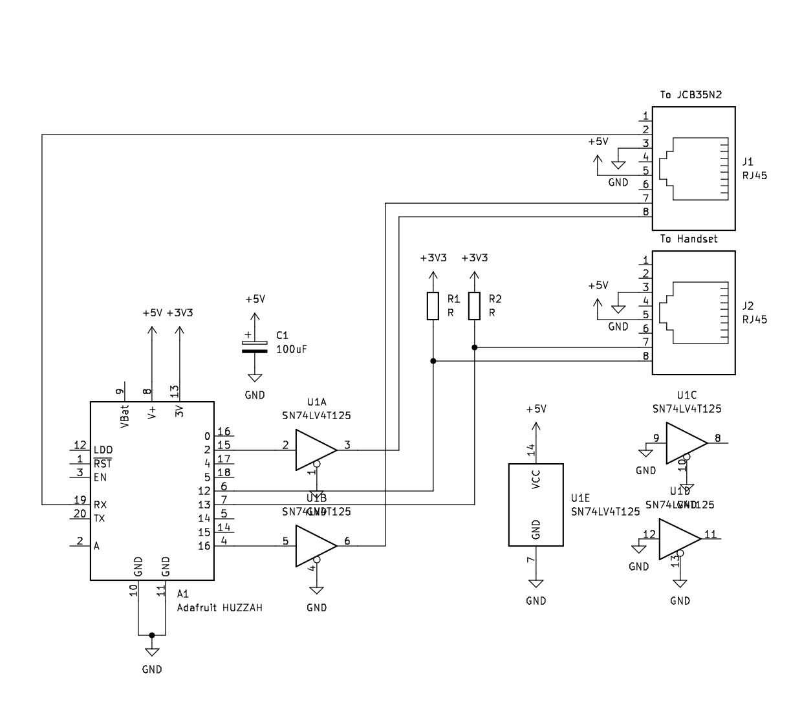

# esphome-jcb35n2

This component enables control of a JCB35N2 based standing desk using ESPHome. Many standing desks use this controller, including the Fully Jarvis.

Features:

- Maintains manual height adjustment from the handset, by pressing and holding the up/down buttons
- Supports setting the desk to a specific height via Home-Assistant
- Supports multiple preset heights, controllable via Home-Assistant
- Supports selecting up to two presets from the handset by double-clicking the up/down buttons

## Hardware

This should work with any ESPHome target that supports a UART and 4 GPIOs.



## Configuration

### Basic Configuration

At a minimum, you'll need to configure the GPIOs for the handset buttons and the outputs to the controller, as well as the name of the `raw_height` sensor which reports the current desk height as reported over the controller's serial port.

```yaml
sensor:
  - platform: jcb35n2
    buttons:
      up: GPIO12
      down: GPIO13
    outputs:
      up: GPIO2
      down: GPIO16
    raw_height:
      name: Desk Raw Height
```

With this minimal configuration, you can use the desk as usual via the handset, and the raw height will be reported to the "Desk Raw Height" sensor. 

### Setpoint Calibration

For this step, you'll need a measuring tape and the basic configuration (above) flashed to your device. Move the desk to the lowest position, and note the value reported by the "Desk Raw Height" sensor; this is `min_raw`. Measure the distance in inches between the floor and the desk top; this is `min_inches`, the height of the desktop corresponding to the minimum position. Next, move the desk to the highest position and note the value reported by the "Desk Raw Height" sensor; this is `max_raw`.

With these three pieces of information, you can add the "setpoint" control to your configuration. This will allow you to set/query the height of the desk in inches via Home-Assistant.

```yaml
sensor:
  - platform: jcb35n2
    buttons:
      up: GPIO12
      down: GPIO13
    outputs:
      up: GPIO2
      down: GPIO16
    raw_height:
      name: Desk Raw Height
    setpoint:
      name: Desk Setpoint
      min_inches: 28.5
      min_raw: 21
      max_raw: 213
```

### Presets

Preset heights can be specified in the configuration. For example, the following defines two presets: 29.3" high for a Sitting preset, and 42.8" high for a Standing preset. Double-clicking the up button selects the Standing preset, and double-clicking the down button selects the Sitting preset.

```yaml
sensor:
  - platform: jcb35n2
    buttons:
      up: GPIO12
      down: GPIO13
    outputs:
      up: GPIO2
      down: GPIO16
    raw_height:
      name: Desk Raw Height
    setpoint:
      name: Desk Setpoint
      min_inches: 28.5
      min_raw: 21
      max_raw: 213
    presets:
      name: Desk Presets
      options:
        - name: Sitting
          height: 29.3
          double_click: down
        - name: Standing
          height: 42.8
          double_click: up
```
